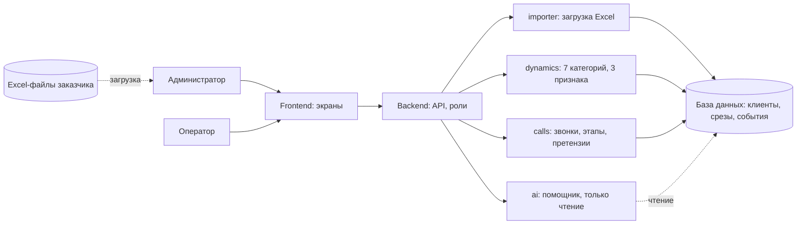

# Схема C4, уровень Container

```mermaid
flowchart LR
  A[Администратор] --> F[Frontend: экраны]
  O[Оператор] --> F
  X[(Excel-файлы заказчика)] -. загрузка .-> A
  F --> B[Backend: API, роли]
  B --> I[importer: загрузка Excel]
  B --> D[dynamics: 7 категорий, 3 признака]
  B --> C[calls: звонки, этапы, претензии]
  B --> AI[ai: помощник, только чтение]
  I --> DB[(База данных: клиенты, срезы, события)]
  D --> DB
  C --> DB
  AI -. чтение .-> DB
```

Закрытый контур: всё, кроме Excel-файлов, работает на одном сервере (Docker Compose).
